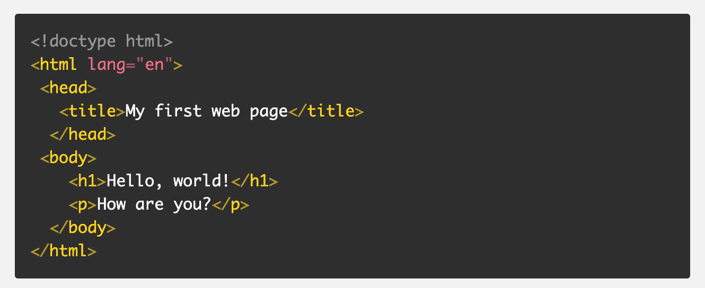
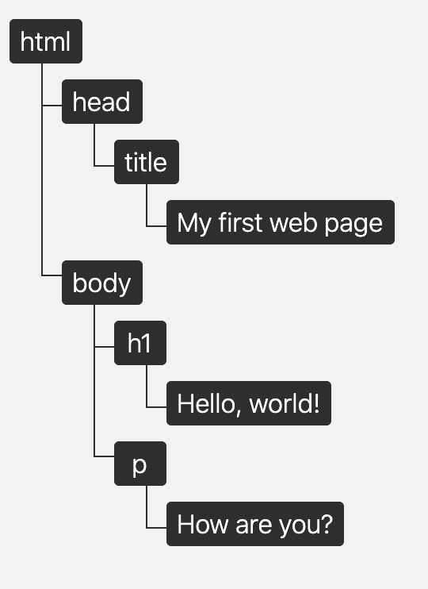

# What is DOM?

 
 DOM stands for: Document Object Model and is basically a way for programs to interpret and decipher the content, structure and style of a web page.

"JavaScript is the language that is read in, DOM is where the stuff pulled over from JavaScript actually happens!"

The DOM uses JavaScript programs to modify the content rendered. Although it looks pretty much like your HTML it's not exactly the same!

The DOM is always going to show PERFECT HTML, despite the actual errors that consist in your current HTML. It's a good thing because can still "grab" what you're looking for and make your changes as necessary...changes to make your page interactive.

# Interactive Capability

By way of selection you can essentially grab an item your looking for, add actions onto those items to make them do things in the browser thus making your webpage interactive. For example query selecting will allow you to pick (we’ll say a button) and then add something like an “onclick” action, which will allow the button to “have a reaction” to the “action” of a user clicking the button.

There are a WIDE RANGE of functions/tools to be used in DOM manipulation. To learn more about DOM in depth [Visit MDN's DOM web docs Guide](https://developer.mozilla.org/en-US/docs/Web/API/Document_Object_Model)
